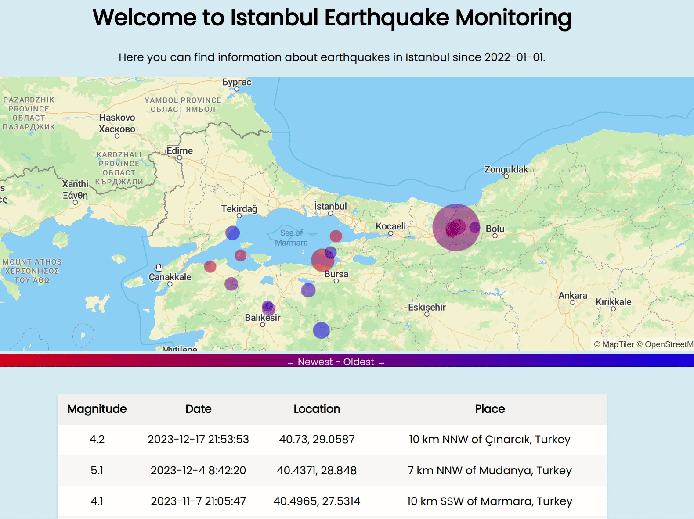

# Summary
Visualize the latest earthquakes around Istanbul.
<!-- show gif located at "./Overview.gif" -->


# How to Run
Install project dependencies:
```bash
npm install
```
Run the project:
```bash
node index.js
```
Navigate to your browser and go to the specified port in `index.js` (default: 3000).
```
http://localhost:3000
```

# Project Stages
## Stage 1 (Completed): 
Print a table of earthquakes around Istanbul with radius x km (above: 400)

## Stage 2: (Completed):
Show them on map using google maps api (or the api of USGS)

## Stage 3:
Combine queries to provide all earthquakes around KAFH (North Anatolia Fault Line).

## Stage 4:
Add other fault lines the same way.

## Stage 5:
Make queries customizable with a beautiful UI.
# Resources
* [USGS API](https://earthquake.usgs.gov/fdsnws/event/1/)

